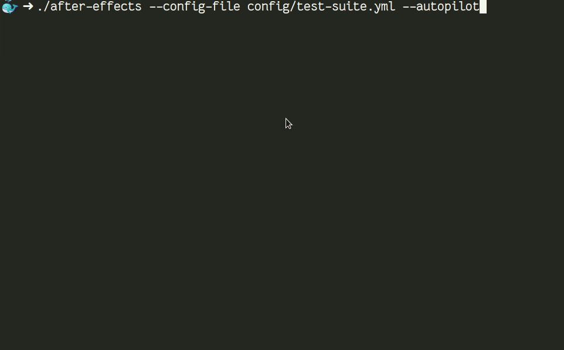

# Ubuntu / Debian Post Installation Script

Effortless way to setup your fresh Ubuntu, Linux Mint and Debian installation.

[![build][build-badge]][build-link]
[![release][release-ci-badge]][release-ci-link]
[![docs][docs-ci-badge]][docs-ci-link]
[![netlify][netlify-badge]][netlify]
[![version][version]][changelog]
[![license][gpl-badge]][license]


## How to use this

### 1. Get the script

```console
wget https://github.com/tprasadtp/ubuntu-post-install/releases/latest/download/after-effects -O after-effects
wget https://github.com/tprasadtp/ubuntu-post-install/releases/latest/download/sha256sums.txt -O sha256sums.txt
sha256sum -c sha256sums.txt --strict
```

### 2. Setup your YAML configuration file

Setup YAML file to suit your needs. Change PPAs, add or delete packages to list, tweak flags etc.
Please see [Configuration](https://ae.prasadt.com/configuration/) & [Tasks](https://ae.prasadt.com/tasks/).

[](https://ae.prasadt.com/configuration/)
[](https://ae.prasadt.com/tasks/)

### 3. Run the script

Run the script as **root**.

Sample configuration can be found in `config` directory.

```console
  chmod +x after-effects
  sudo ./after-effects --config-file <path-to-your-config>
```

## See in Action

[](docs/assets/images/in-action.gif)

## FAQ & Documentation

See /docs or visit [docs][docs]

![commit][commit]


## Supported Distributions

[](https://www.ubuntu.com/desktop)
[](https://kubuntu.org/)
[](https://lubuntu.net/)
[](https://xubuntu.net/)
[](https://ubuntu-mate.org/)
[](https://ubuntubudgie.org/)
[](https://ubuntustudio.org/)
[](https://ubuntugnome.org/)
[](https://www.linuxmint.com/)
[](https://www.debian.org/)
[](https://elementary.io/)

I have not tested the script on the distros listed below. Because they use Ubuntu as their base,
It should work fine. But no promises.

[](https://neon.kde.org/)
[](https://system76.com/pop)
[](https://www.bodhilinux.com/)
[](https://peppermintos.com/)

For a complete  list of supported distributions [click here](https://ae.prasadt.com/faq/distros/).

## Features

- [Install packages](https://ae.prasadt.com/tasks/#install-apt-packages)
- [Add repositories](https://ae.prasadt.com/tasks/#add-repositories)
- [Remove pre installed](https://ae.prasadt.com/tasks/#purge-unwanted-packages)
- [Python 2 and Python 3 Packages](https://ae.prasadt.com/tasks/#install-python-packages-via-pip)
- [Add PPAs](https://ae.prasadt.com/tasks/#add-personal-package-archives-ppa)
- [Install deb packages](https://ae.prasadt.com/tasks/#install-debian-package-archives-deb-files)
- [Install static binaries](https://ae.prasadt.com/tasks/#install-static-binaries)
- [Install snap packages](https://ae.prasadt.com/tasks/#installing-snap-packages)

Also handles adding several tweaks and fixes necessary to add repositories and PPAs, supports completely non-interactive mode, so that you can let it run while you have moaar ☕

## Supported External repositories

| Name                 | Key |
|:---------------------|:--- |
|Docker | docker
|Duo Security Unix | duo
|Google Chrome & Google Earth | google
|Google Cloud SDK | googlecloud
|Insync | insync
|Mendeley desktop | mendeley
|ROS | ros
|Signal for desktop | signal
|Skype | skype
|Spotify Desktop | spotify
|Visual Studio code | vscode
|Wine HQ | winehq
|Github CLI | github
|Hashicorp Tools(terraform, consul etc) | hashicorp
|[Gvisor container runtime][gvisor] | gvisor

## Issues & Help

- Please check [FAQ][FAQ] & [known issues][known-issues].
- Please include the log file and terminal output while opening an issue.

## Contributing & Forks

See [Contributing and forks](/CONTRIBUTING.md)


[FAQ]: https://ae.prasadt.com/faq/dependencies/
[docs]: https://ae.prasadt.com/getting-started/
[known-issues]: https://ae.prasadt.com/faq/errors/
[changelog]: https://ae.prasadt.com/changelog/

[build-badge]: https://github.com/tprasadtp/ubuntu-post-install/workflows/build/badge.svg
[build-link]: https://github.com/tprasadtp/ubuntu-post-install/actions?query=workflow%3Abuild
[release-ci-badge]: https://github.com/tprasadtp/ubuntu-post-install/workflows/release/badge.svg
[release-ci-link]: https://github.com/tprasadtp/ubuntu-post-install/actions?query=workflow%3Arelease

[docs-ci-badge]: https://github.com/tprasadtp/ubuntu-post-install/workflows/docs/badge.svg
[docs-ci-link]: https://github.com/tprasadtp/ubuntu-post-install/actions?query=workflow%3Adocs

[netlify-badge]: https://api.netlify.com/api/v1/badges/887c3d5c-5203-46b9-a31d-67cada282f36/deploy-status
[netlify]: https://app.netlify.com/sites/ubuntu-post-install/deploys

[version]: https://img.shields.io/github/v/release/tprasadtp/ubuntu-post-install?label=version

[commit]: https://img.shields.io/badge/dynamic/json.svg?label=commit&style=flat&url=https://ae.prasadt.com/commit.json&query=commit.id
[commit-deployed-ts]: https://img.shields.io/badge/dynamic/json.svg?label=on&style=flat&url=https://ae.prasadt.com/commit.json&query=ts
[deployed]: https://img.shields.io/badge/dynamic/json.svg?label=deployed&color=success&style=flat&prefix=%23&url=https://ae.prasadt.com/commit.json&query=build.number

[gpl-badge]: https://img.shields.io/badge/License-GPLv3-ff69b4
[license]: https://github.com/tprasadtp/ubuntu-post-install/blob/master/LICENSE

[gvisor]: https://gvisor.dev
