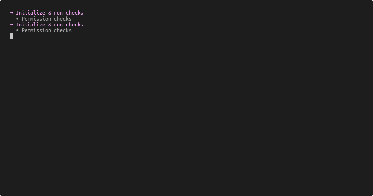

# After-Effects

An Effortless & Simple post-installation script for Ubuntu, Linux Mint, Elementary, Debian and their derivatives.


[![build][build-badge]][build-link]
[![release][release-ci-badge]][release-ci-link]
[![docs][docs-ci-badge]][docs-ci-link]
[![netlify][netlify-badge]][netlify]
[![version][version]][changelog]
[![license][gpl-badge]][license]

[](https://ae.prasadt.com)

This script is built for one purpose only. Automating post installation tasks on a fresh Ubuntu/Debian installation.

## Usage

## Step 1: Get the script and verify its integrity

```bash
wget https://github.com/tprasadtp/ubuntu-post-install/releases/latest/download/after-effects -O after-effects
wget https://github.com/tprasadtp/ubuntu-post-install/releases/latest/download/sha256sums.txt -O sha256sums.txt
sha256sum -c sha256sums.txt --strict
```

## Step 2: Update the config

Update the config file to suit your needs. Please see [Configuration](/configuration/) & [Tasks](/tasks/) for more details. Some example configs can be found [here](https://github.com/tprasadtp/ubuntu-post-install/tree/master/config).

## Step 3: Run it

Run the script as **root**.

```bash
chmod +x after-effects
sudo ./after-effects -c <your config.yml>
```

## See in Action



## Supported Distros

[](https://www.ubuntu.com/desktop)
[](https://kubuntu.org/)
[](https://lubuntu.net/)
[](https://xubuntu.net/)
[](https://ubuntu-mate.org/)
[](https://ubuntubudgie.org/)
[](https://ubuntustudio.org/)
[](https://ubuntugnome.org/)
[](https://www.linuxmint.com/)
[](https://www.debian.org/)
[](https://elementary.io/)

I have not tested the script on following distros. Because they use ubuntu as their base,
It should work fine. But no promises.

[](https://neon.kde.org/)
[](https://system76.com/pop)
[](https://www.bodhilinux.com/)
[](https://peppermintos.com/)

!!! tip "Tip"
    Please check [Supported-Distros](/faq/distros/) for complete list of supported distributions.

## Features

- Adding Repositories (Limited set of curated repositories only)
- Installing packages from system repositories
- Installing statically linked binaries
- Remove Preinstalled packages
- Install PIP packages. (You should use `virtualenv` for your projects, **ONLY** install pip packages which are absolutely essential.)
- Add PPAs (Ubuntu & Ubuntu derivatives only)
- Debian (.deb) packages
- Snap packages

[build-badge]: https://github.com/tprasadtp/ubuntu-post-install/workflows/build/badge.svg
[build-link]: https://github.com/tprasadtp/ubuntu-post-install/actions?query=workflow%3Abuild

[release-ci-badge]: https://github.com/tprasadtp/ubuntu-post-install/workflows/release/badge.svg
[release-ci-link]: https://github.com/tprasadtp/ubuntu-post-install/actions?query=workflow%3Arelease

[docs-ci-badge]: https://github.com/tprasadtp/ubuntu-post-install/workflows/docs/badge.svg
[docs-ci-link]: https://github.com/tprasadtp/ubuntu-post-install/actions?query=workflow%3Adocs

[netlify-badge]: https://api.netlify.com/api/v1/badges/887c3d5c-5203-46b9-a31d-67cada282f36/deploy-status
[netlify]: https://app.netlify.com/sites/ubuntu-post-install/deploys

[version]: https://img.shields.io/github/v/release/tprasadtp/ubuntu-post-install?label=version
[gpl-badge]: https://img.shields.io/badge/License-GPLv3-ff69b4
[license]: https://github.com/tprasadtp/ubuntu-post-install/blob/master/LICENSE

[changelog]: https://ae.prasadt.com/changelog/
